# Mist Disconnect Console

Client disconnect RCA for **Juniper Mist**. Paste an Observer (read-only) API token, pick a site and client MAC, and get a verdict that correlates RF, 802.11 reason codes, DHCP/DNS, Marvis, Radio Management occupancy, **7-day radio events (including Post radar / DFS)**, and **Microsoft Teams / Zoom calls**.

**Latest: [v1.1](https://github.com/InterconnectedSystems/lilac-lilac-maple-ruby/releases/tag/v1.1)** — DFS radar session alerts, same-AP gating, full session history, portal-parity Radio Events.

Click **Run sample investigation** on the home page to walk the demo with no token. Sample data uses fictional `DEMO-AP-F2-*` names only.

   

---

## What’s new in v1.1

| Feature | Why it matters |
|---|---|
| **Alert · session on radar AP** | If a client **session** was associated to the AP that took a DFS / Post radar hit, a pulsing banner names that session and that exact radio event. Juniper’s RRM docs: the AP deauthenticates every associated station. |
| **Same-AP gate** | Radar on a neighbor, or on today’s serving AP when the client was elsewhere, is **not** a correlation. Session AP at the radar timestamp must equal the radar AP. |
| **Exact rows under the banner** | The matching session (connect / disconnect / AP / SSID / band) and the matching Radio Event (date, channel `36 → 149`, width, power, **Post radar**) are drawn under the alert — not just a paragraph. |
| **7-day Radio Events** | Same source as Mist **Site → Radio Management → Radio Events**. The API requires `band`; the console fetches `5`, `24`, and `6` in parallel (5 GHz paginated — that is where DFS lives). Labels match the portal: *Post radar*, *Interference AP non wifi*, *Scheduled site RRM*. |
| **Teams / Zoom (7 days)** | Call window, meeting id, audio/video quality. A Teams meeting in progress during same-AP Post radar is highlighted as the media failure. |
| **Full session list** | Every association in the window, newest first, scrollable table. Rows that overlapped radar on **that** AP are tagged `radar`. |
| **CLIENT_IP_ASSIGNED is OK** | DHCP Success / IP Assigned are positive events (Mist Insights). Only timed-out / denied / terminated / bad-IP are FAIL. |

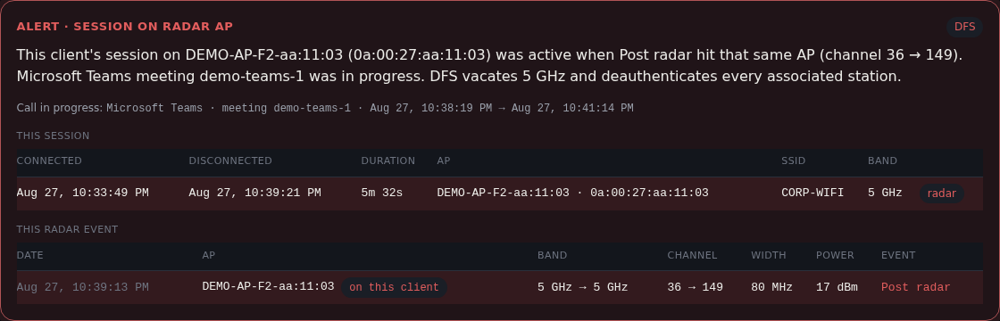

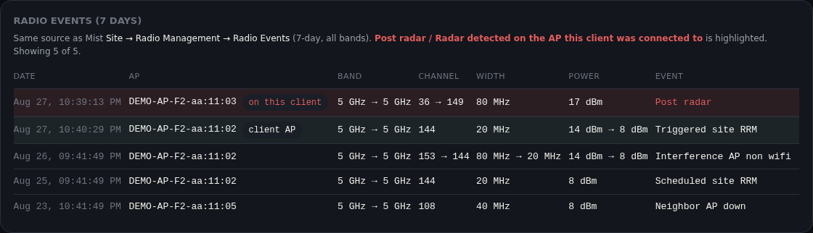

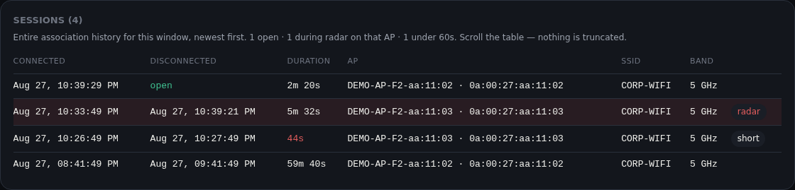

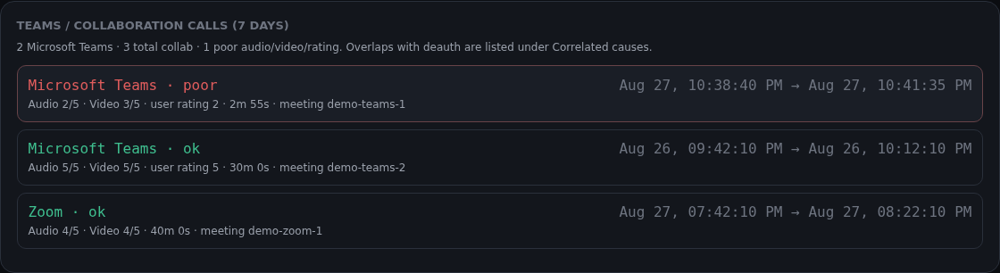

---

## Install and run (Python) — this is the v1.1 console

No pip packages. Windows, macOS, and Linux.

```bash
git clone https://github.com/InterconnectedSystems/lilac-lilac-maple-ruby.git
cd lilac-lilac-maple-ruby

# Windows
py -3 mist_disconnect_console.py

# macOS / Linux
python3 mist_disconnect_console.py
```

It opens a local browser page. Ctrl+C stops the server. The API token is sent from the browser to this process, then to Mist over HTTPS GET — it is not written to disk.

```bash
python3 mist_disconnect_console.py --self-test
```

---

## Install and run (web)

The Vite / React tree in this repo is the published companion UI. **v1.1 radar / Teams / session-alert work is in `mist_disconnect_console.py`.** Use the Python command above for the current RCA engine.

```bash
git clone https://github.com/InterconnectedSystems/lilac-lilac-maple-ruby.git
cd lilac-lilac-maple-ruby
npm install
npm run dev
```

---

## Screenshots

Captured from the built-in **sample investigation** (Sample HQ — Floor 2, fictional APs).

### Home — Observer token gate

| Desktop | iPhone |
|---|---|
| 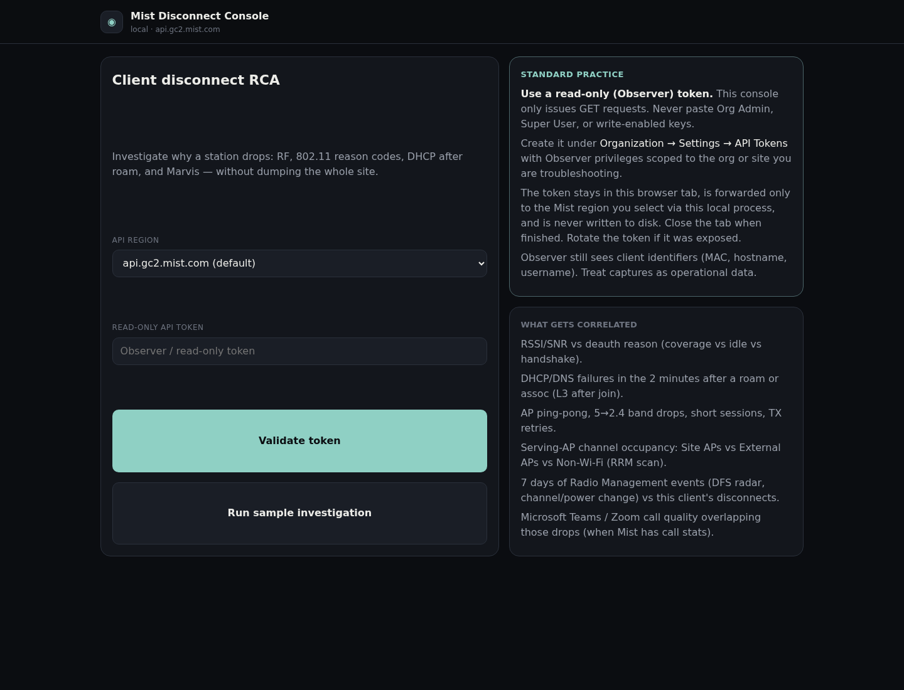 | 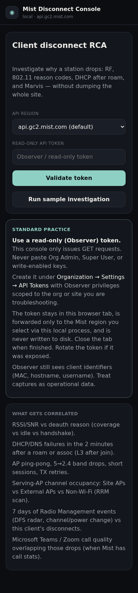 |

The console only issues **GET** requests. Use an Observer / read-only token from **Organization → Settings → API Tokens**. Org Admin and write-enabled keys do not belong here.

### Investigation board (v1.1)

The banner is the first thing on the board when a session was on the radar AP.

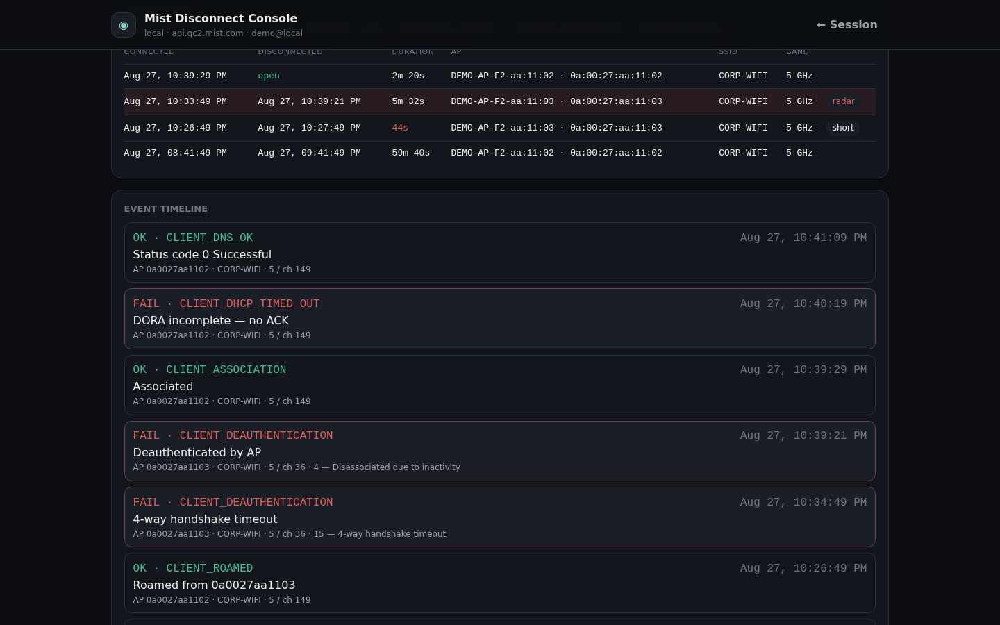

| Verdict | Phone fold |
|---|---|
| 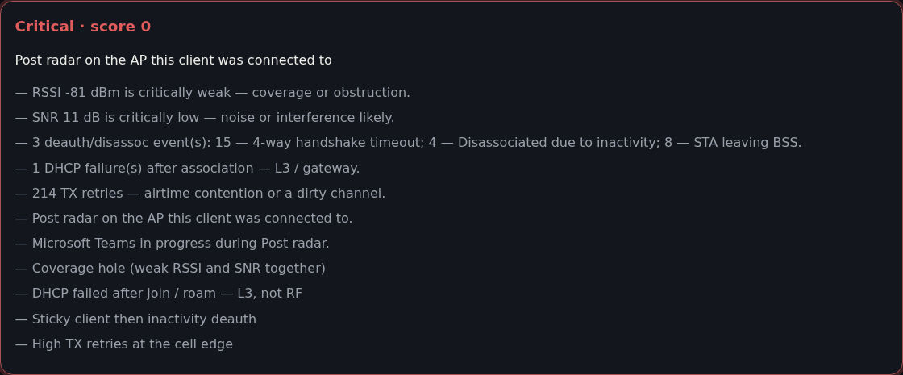 | 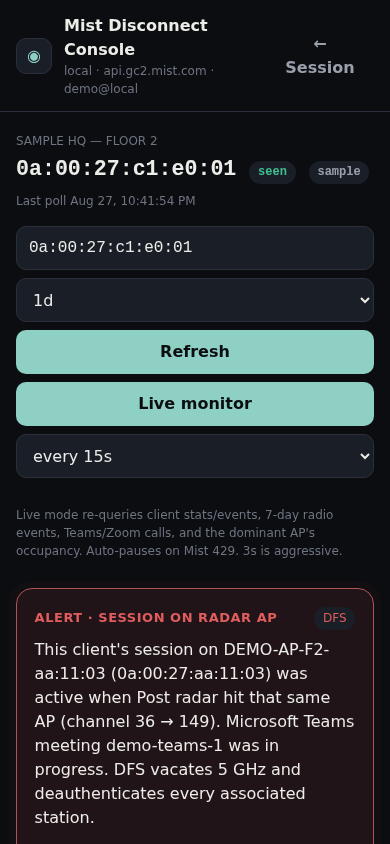 |

### Correlated causes

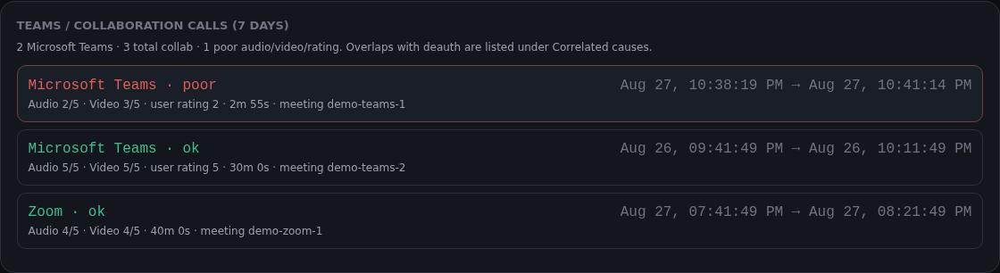

Radar and Teams cards include the call name, meeting id, session AP, radar timestamp, and `pre → post` channel.

### Current radio values (occupancy)

Same stacked histogram Mist shows under **Site → Radio Management → Current Radio Values**.

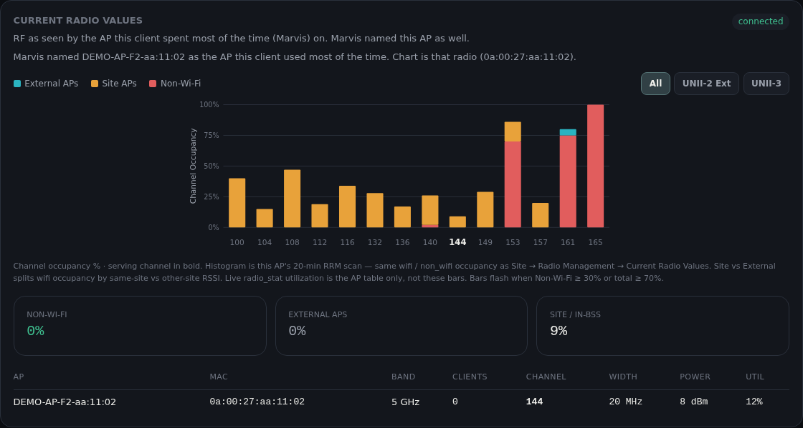

| Color | Meaning |
|---|---|
| **Orange** | Site APs |
| **Teal** | External APs |
| **Red** | Non-Wi-Fi interference |

### Event timeline and Marvis

| Client events | Marvis |
|---|---|
| 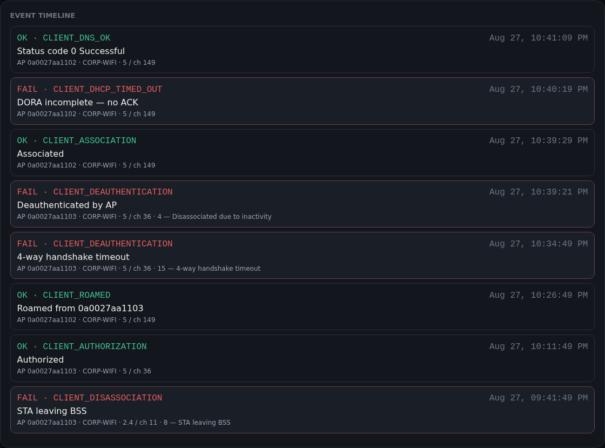 | 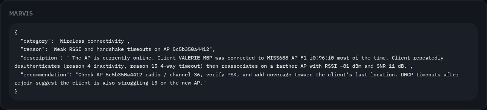 |

`CLIENT_IP_ASSIGNED` shows **OK**. DHCP timed out / denied stay **FAIL**.

### Full board

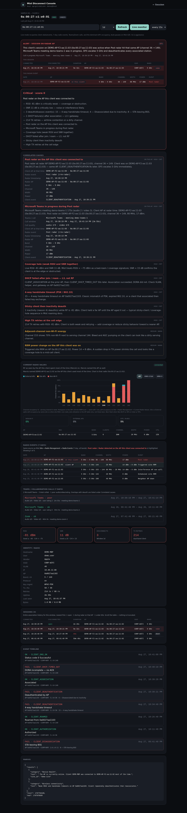

---

## What it does

1. **Connect** — Select the Mist region (default `api.gc2.mist.com`) and paste an Observer token. `/self` validates the org.
2. **Scope** — Pick org, site, client MAC, and lookback (`1h` / `6h` / `1d` / `1w`).
3. **Diagnose** — Per-MAC stats, events, **all sessions** (paginated), Marvis, AP inventory, occupancy, **7-day RRM events by band**, Teams/Zoom calls.
4. **Alert** — If a session covered a Post radar / radar-detected event **on that same AP**, the banner shows that session and that radio row.
5. **Verdict** — Score + primary cause + same-AP radar / Teams correlations.
6. **Live monitor** — Re-query (radio events + calls included). Auto-pauses on Mist HTTP 429.

---

## What gets correlated

| Signal | Gate |
|---|---|
| **Post radar / DFS on the AP this session was on** | Session `connect…disconnect` covers the radar timestamp **and** `session.ap == radar.ap` |
| **Teams/Zoom in progress during that radar** | Call window overlaps the radar time **and** same-AP gate |
| RSSI / SNR vs deauth reason | Coverage vs idle timeout vs handshake |
| DHCP / DNS after roam or assoc | Failures only (not IP Assigned) |
| AP ping-pong and 5 → 2.4 | Sticky / oscillating client |
| Serving-AP occupancy | Site vs external vs non-Wi-Fi |
| RRM power / channel change | Client associated to that AP at the change |
| Marvis narrative | Names the AP the client used most of the time |

A radar event on a different AP than the session is **dropped**. Same channel on another AP is coincidence, not a cause.

---

## Occupancy vs the Mist portal

The histogram is **this AP’s 20-minute RRM scan** (`/sites/{id}/rrm/current/devices/{device}/band/{band}`).

Radio Events are `GET /sites/{id}/rrm/events?band={5\|24\|6}&duration=7d` (band is required; 400 `valid band is required` otherwise).

---

## API usage (GET only)

| Step | Endpoint |
|---|---|
| Validate token | `GET /self` |
| List sites | `GET /orgs/{org}/sites` |
| Live client | `GET /sites/{site}/stats/clients/{mac}` |
| Client search / events / sessions | `GET /sites/{site}/clients/search`, `.../clients/{mac}/events`, `.../clients/sessions/search` |
| Marvis | `GET /orgs/{org}/troubleshoot` |
| AP inventory + stats | `GET /sites/{site}/devices?type=ap`, `GET /sites/{site}/stats/devices` |
| Occupancy | `GET /sites/{site}/rrm/current/devices/{device}/band/{24\|5\|6}` |
| Radio events (7d) | `GET /sites/{site}/rrm/events?band={24\|5\|6}&duration=7d` |
| Teams / Zoom | `GET /sites/{site}/stats/calls/search?mac={mac}&duration=7d` |

No configuration is written. The token stays in the browser tab and is never stored in a database.

---

## Token practice

- Create the key under **Organization → Settings → API Tokens** with **Observer** privileges.
- Default region is `api.gc2.mist.com`.
- Never paste Org Admin, Super User, or write-enabled keys.

---

## Repo layout

```
mist_disconnect_console.py   v1.1 RCA engine (stdlib only) — start here
screenshots/                 sample investigation captures (fictional DEMO-AP-F2 names)
src/                         published web companion (v1.0 UI)
```
